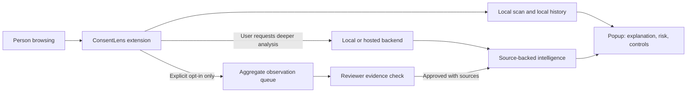
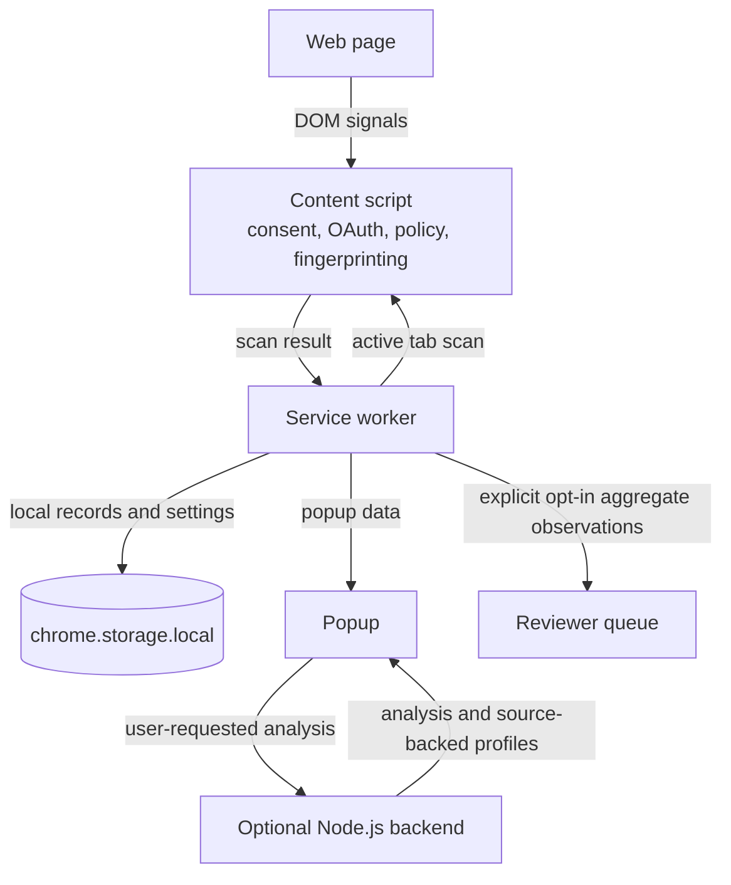

# ConsentLens

[](https://github.com/modithakolli/consentlens/actions/workflows/extension-tests.yml)

> A local-first browser trust layer that explains consent choices, trackers, account permissions, and privacy policies before people decide what to share.

ConsentLens helps people understand what a website is doing with their data, what changed, and what action they can take. It scans locally in the browser first, labels uncertainty clearly, and only uses a backend for deeper analysis or explicitly enabled aggregate observations.

## What it is for

- **People** who want a plain-English explanation before accepting cookies, connecting an account, or continuing on a site.
- **Privacy, product, and security teams** who need to test real consent journeys and document evidence.
- **Researchers and reviewers** who want source-backed public profiles instead of unreviewed crowd data.

## How it works



The extension does not treat an observed network request as proof that personal data was transferred. An unknown domain appears as **Unclassified third party**, not as safe or unsafe by default.

## Extension internals



## Current MVP

| Area | What is available now | Evidence / boundary |
| --- | --- | --- |
| Understand | Tracker mapping, policy links, plain-English summary, fingerprinting hints | Network and visible-page signals; results show uncertainty |
| Consent | Warning before positive consent actions, including preference panels | CMP fixtures cover OneTrust, Didomi, Sourcepoint, and dialogs |
| Account access | OAuth scope detection and Low/Medium/High/Critical heatmap | Scope meaning is explained in the popup |
| Control | Consent receipts, data-rights request draft, local timeline | Stored locally by default |
| Trust | Public profiles, evidence URLs, confidence, review dates, domain claims | Public facts require source-backed review |
| Intelligence governance | Opt-in aggregate observations enter a reviewer queue | Observations never publish automatically |

## Run locally

### 1. Load the extension

1. Open Chrome or Edge and visit `chrome://extensions`.
2. Turn on **Developer mode**.
3. Click **Load unpacked**.
4. Select [`extension`](./extension), not the repository root.
5. Open a normal website and click the ConsentLens toolbar icon.

Reload the extension after pulling changes or editing files.

### 2. Start the optional backend

The extension works locally without the backend. Start it for policy analysis, public profiles, claims, and reviewer workflows.

```powershell
cd backend
npm test
npm start
```

The local API listens on `http://localhost:8787`.

Useful local pages:

- `http://localhost:8787/profiles` for public source-backed profiles
- `http://localhost:8787/review` for the private reviewer console

Set `REVIEWER_TOKEN` before using reviewer routes. Never expose that token in a public deployment.

### 3. Run extension checks

From the repository root:

```powershell
node extension/test/scan-fixtures.mjs
node extension/test/cmp-flow-fixtures.mjs
node extension/test/storage-schema.mjs
node extension/test/popup-risk.mjs
```

## Built with

- Chrome Extension Manifest V3, JavaScript, and `chrome.storage.local` for local-first scans and records.
- A Node.js HTTP backend for optional policy analysis, profiles, claims, and reviewer workflows.
- Node.js `.mjs` fixture and schema checks for the extension; the backend also has a Node.js test suite.

## Design decisions

- **Local first:** page scanning and history stay in the browser by default; the backend is optional and deeper analysis is user initiated.
- **Observe, do not infer transfer:** `webRequest` reveals request destinations, not request bodies or proof that personal data was sent.
- **Keep uncertainty visible:** unknown providers are labeled “Unclassified third party” until there is enough evidence to classify them.
- **Review before publishing:** aggregate observations enter a reviewer queue; public intelligence requires sources and a human decision.

## Validation status

The repository contains four extension fixture checks and a separate backend test suite. The current local tracker-observation archive records 28 distinct third-party hosts and 203 host requests. This is an observation count, not a count of unique tested sites, and it does not establish false-positive or false-negative rates. The live-site ledger is not yet populated with outcomes. See the [validation ledger](./docs/validation-ledger.md) for the sites and fields to record.

## Privacy model and permissions

- Scans, consent receipts, timeline entries, and settings live in `chrome.storage.local` by default.
- Backend policy analysis happens only when the user requests it in the popup.
- Aggregate tracker observations require an explicit option. They exclude visited-page URLs and user identity.
- `activeTab` and `scripting` scan the active page; `storage` saves local records; `webRequest` observes request destinations; broad host access currently enables full-site scanning.
- ConsentLens never modifies traffic, blocks content, reads request bodies, or claims legal compliance.

Read the complete [privacy and permissions note](./docs/extension-privacy-and-permissions.md), [intelligence governance](./docs/intelligence-governance.md), and [UX principles](./docs/ux-principles.md).

## Validation before external use

ConsentLens is an MVP. Test the exact browser and site journey before relying on a result. The project keeps a [50–100 site validation ledger](./docs/validation-ledger.md) for recording false positives, false negatives, and evidence.

Important limitations:

- Consent managers change their markup frequently.
- Policy parsing provides guidance, not legal advice.
- The service database is growing and does not yet cover every company or domain.
- A “ConsentLens Verified” label must not exist until independent assessment, expiry, re-check, and revocation rules operate in production.

## Project structure

```text
extension/       Manifest V3 extension and local scanner
extension/src/popup/
                 Popup orchestrator and feature renderers
backend/         Local HTTP API, policy analysis, claims, reviewer routes
shared/intel/    Versioned service, retention, AI-training, and sharing facts
docs/            Governance, privacy, UX, presentation, and validation notes
```

## Contributing

Open an issue or pull request with a reproducible site, browser version, expected outcome, actual outcome, and evidence. Do not add an intelligence fact from a browsing observation alone: include a public evidence URL, effective date, confidence, applicability, and review date.

## License

No open-source license has been granted yet. Do not reuse or redistribute this repository outside the project without permission from its owner.
